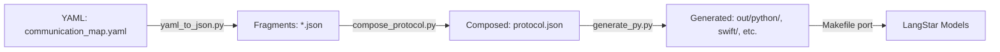

Here is a **clean, unambiguous clarification** of what your *protocol* system is now — and what it must become to support long-term stability across Python / JS / Swift / Kotlin / Rust / Go / Edge devices.

---

# ✅ The Protocol System = **Three Layers Working Together**

### **Layer 1 — `protocol.json` (DATA: the single source of truth)**

* Defines namespaces
* Defines events
* Defines allowed directions
* Defines payload shapes
* Defines device roles, channels, phases (if present)
* This is **the only file developers edit** to add new events.

Everything else is derived from it.

---

### **Layer 2 — `protocol.schema.json` (RULES: the grammar)**

This file defines the *structure* of protocol.json, not its contents.

Examples of what the schema enforces:

* `namespaces` must be a dictionary
* Each namespace must contain `events`
* Each event must define direction + payload
* Payload fields must use approved types (`string`, `number`, `boolean`, `array<T>`, `object`, etc.)
* No unknown fields allowed
* No unknown types allowed
* No missing keys allowed

This ensures **protocol.json never drifts** or becomes inconsistent.

It is your **IDL grammar** (Interface Definition Language).

---

### **Layer 3 — Schema-Aware Generators**

These read `protocol.json` *after validation* and generate:

* Python enums + Pydantic models
* TypeScript enums + Zod models
* Swift enums + Codable models
* Kotlin enums + data classes
* Rust enums + serde models
* (future) Go enums + struct models

These are not validators — these are **builders**.

They assume protocol.json is valid (because validation happened first).

The generators guarantee **no language diverges** in event names, payload types, or directions.

---

# ❓ Do validators exist per-language?

### **Short answer: No — you do NOT want per-language validators.**

### **Long answer: you only need ONE validator.**

Here is the right architecture:

---

## ✅ **ONE validator (JSON Schema validator) runs BEFORE any codegen**

Validation can occur:

* in Python (`jsonschema` package),
* or in Node (`ajv`),
* or in Go, Rust, etc.

But **you only need one**.

You run validation once:

```
python protocol/tools/validate.py
```

(or Node/Go version if preferred)

If validation succeeds → run codegen.

If validation fails → exit with error, do NOT generate code.

---

### ❌ You do NOT want:

* A Python validator inside Python codegen
* A Swift validator inside Swift codegen
* A Kotlin validator inside Kotlin codegen

Why?

Because:

1. **They will drift**
2. They become inconsistent
3. They triple or quadruple maintenance
4. They create different interpretations of the schema
5. They massively increase friction for developers

The entire point of JSON Schema is:

> **Single source of validation, independent of implementation languages.**

So:

### ✔ You should maintain **one schema.json**

### ✔ You should run **one validator**

### ✔ All languages rely on the generated results, not on schema logic

---

# 🔵 The Correct Protocol Pipeline

### **Step 1 — Developer edits protocol.json**

(e.g., adds a new event)

### **Step 2 — Validator checks protocol.json**

(using `protocol.schema.json`)

### **Step 3 — If valid, generators run**

* Python
* TS
* Swift
* Kotlin
* Rust
* Go (optionally)

### **Step 4 — Generated code used in FE / BE / Edge**

### **Step 5 — CI enforces validation on every pull request**

This ensures:

* No invalid protocol merges
* All languages stay in sync
* No manual drift
* All components speak one dialect

---

# 🟩 Summary — Your understanding is correct

### ✔ Yes, the system now consists of:

1. **protocol.json** (data)
2. **protocol.schema.json** (rules)
3. **schema-aware generators**
4. **validator (single), not per-language**

### ✔ And yes — this is exactly how modern API languages (gRPC, protobuf, Thrift, GraphQL, OpenAPI) prevent drift.

### ✔ You must avoid “one validator per-language”.

One validator → many generators → many languages → one dialect.

---

# If you want, I can now generate:

### **A. `validate.py` universal validator (Python)**

or

### **B. cross-platform validator (Node + Python)**

or

### **C. GitHub Actions CI validator**

or

### **D. schema v2.0 with future-proof grammar**

or

### **E. HOWTO: Add New Events (step-by-step)**

Just tell me:

**“Generate validator”, “Generate CI”, “Generate schema v2.0”, or “Generate HOWTO”.**

+++++++++++++++++++++++++ Updates to improve enhancements and porting to langstar work flow

Here's the updated **`README.md` for `~/mtv/protocol/`**, reflecting the **enhancements, tools, and Makefile-based usage** introduced during the protocol scalability and LangStar porting phases:

---

# 📡 `protocol/` — Unified Communication Schema & Codegen for LangStar and Demos

This directory defines and manages the **event-driven communication protocol** shared across:

* Web/mobile frontends
* Python backends (FastAPI, LangChain)
* Embedded systems or edge devices
* LangStar framework

It enables consistent messaging using validated schemas and generates language-specific models automatically.

---

## 📦 Key Components

| Path                     | Purpose                                                           |
| ------------------------ | ----------------------------------------------------------------- |
| `protocol.json`          | Composed master spec of all event namespaces                      |
| `protocol.schema.json`   | JSON Schema used to validate `protocol.json`                      |
| `communication_map.yaml` | System-level declaration of "who talks to whom"                   |
| `tools/*.py`             | Enhancement tools (YAML → JSON, compose fragments, emit models)   |
| `codegen/`               | Language-specific code generators (Swift, Python, TS, Rust, etc.) |
| `out/`                   | Output of all generated language models                           |

---

## ⚙️ Workflow Overview



---

## 🧰 Usage via Makefile

From the `~/mtv/protocol/` directory:

### ✅ Full Protocol Enhancement & Port:

```bash
make all
```

### 🔍 Individual Steps

```bash
make json       # YAML → namespace JSON fragments
make compose    # Fragments → protocol.json
make validate   # Validate protocol.json
make python     # Generate Python code
make port       # Copy Python models into langstar/communication/protocol/
make clean      # Reset all outputs
```

---

## 🚀 How to Add a New Communication Participant or Channel

1. Edit `communication_map.yaml`
2. Run:

   ```bash
   make json compose validate
   ```
3. Update event definitions in the resulting `*.json` fragments
4. Re-run:

   ```bash
   make compose validate python port
   ```

---

## 🧩 Generated Files Go To

```text
out/
└── python/
    └── mtv_protocol/
        ├── enums/
        ├── models/
        ├── protocol_event.py
        └── registry.py

➡ Copied to:
~/mtv/langstar/communication/protocol/
```

---

## 🧠 Philosophy

This system follows:

| Principle            | Meaning                                                    |
| -------------------- | ---------------------------------------------------------- |
| **Doc-centric**      | YAML is the source of truth                                |
| **Interface-first**  | Code is generated from schema                              |
| **Agent-compatible** | Future plans support protocol agents, dynamic scaffolding  |
| **Cross-language**   | Generate Swift, Kotlin, JS, Rust, Python, TS from 1 schema |
| **Survivable**       | State and schema persist in Git + DB across system resets  |

---

Let me know if you’d like this turned into Markdown, HTML, or converted into a tutorial notebook.

================ Update HOW TO ==========

Here's a polished `README.md` snippet to place at the top of `langstar/communication/protocol/README.md`:

---

````markdown
# 🌐 LangStar Protocol (Auto-Generated)

This module defines the **structured, multi-language communication protocol** used across all LangStar agents, frontends, and subsystems.

---

## ✅ Overview

This directory is the output of a codegen pipeline driven by a single source of truth: [`communication_map.yaml`](../../../../protocol/communication_map.yaml). It defines:

- 💬 **Who talks to whom** (e.g. frontend → backend, edge ↔ server)
- 🧱 **What messages exist** (per participant namespace)
- 🧩 **Event schemas + payloads** per message

All outputs here are **auto-generated** and **schema-validated** from a shared `protocol.json`.

---

## 📦 Layout

```text
protocol/
├── enums/               # Auto-generated enums per participant
├── models/              # Auto-generated payload schemas per participant
├── protocol_event.py    # Registry of supported events
├── registry.py          # Unified event loader for LangStar
└── codegen/, out/, ...  # Codegen context (non-functional here)
````

---

## 🔁 Regenerate Protocol

If you need to modify the protocol (e.g. add an event, change payloads):

1. Edit [`communication_map.yaml`](../../../../protocol/communication_map.yaml)
2. Run from root:

   ```bash
   cd ~/mtv/protocol
   make clean all
   ```
3. Python models will be copied here automatically

> ⚠️ Never manually edit code in this directory — always regenerate it.

---

## 🌍 Supported Languages

* Python ✅ (active in LangStar)
* Swift
* JavaScript / TypeScript
* Kotlin
* Rust

See `/protocol/out/*` for full language outputs.

---

## 🧠 Cognitive Context

LangStar agents reason over protocol via:

* **`protocol.json`** as world knowledge
* **Validation schema** to detect drift
* **Toolchains** to generate agents, docs, diagrams

This enables **self-sustaining cognitive development** of LangStar itself.

---

## 🛠️ Maintainer Notes

This module is the result of:

* `tools/yaml_to_json.py`: maps → fragments
* `tools/compose_protocol.py`: fragments → `protocol.json`
* `validate.py`: enforces `protocol.schema.json`
* `/codegen/`: emits language-specific models

Generated by `make all` in the `protocol/` directory.

```

---

Would you like this added to the file for you, or would you like a corresponding Mermaid diagram as well?
```

